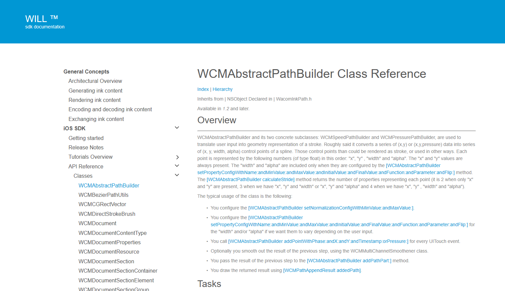

# Getting Started 

## iOS Development Environment

The WILL SDK for Ink requires Xcode 6 or higher

## Download the SDK

Download the SDK from https://developer.wacom.com/developer-dashboard

* Login using your Wacom ID
* Select **Downloads for ink**
* Download **WILL SDK for iOS**
* Accept the End User License Agreement to use the SDK

The downloaded Zip file contains the SDK with documentation.

## SDK License

The SDK is free of charge and does not need a license.

## Using the WILL SDK

### Folder structure
The folder contains the following:

`ios/`
* `Samples/` This folder contains sample Xcode projects that demonstrate basic uses of WILL SDK. 

  * **DrawingWithTouch/** This tutorial demonstrates how to use WILL SDK to draw strokes produced by the user touch input.
  * **StrokeEncodingAndDecoding/** This tutorial demonstrates how to use WILL SDK to encode strokes into a compressed binary data and how to reconstruct them.
  * **StrokeManipulationWithEraser/** This tutorial demonstrates how to make changes in a collection of strokes by implementing an Eraser tool.
  * **StrokeManipulationWithSelection/** This tutorial demonstrates how to make changes in a collection of strokes by implementing a Selection tool.
  * **RasterManipulation/** This tutorial demonstrates how to load the `UIImage` class into the WILL context and mask it with paths created by touch input.

* `sdk/WILLCore.framework` The WILL SDK framework.

### Configure your Xcode Project

* Drag the WILLCore.framework folder into the Frameworks section of your Project Navigator. Depending on your needs, you can clear the Copy items into destination group's folder checkbox.
* Add the libc++.dylib library in the Linked Frameworks and Libraries list in the General section of your target.
* Add the libz.dylib library in the Linked Frameworks and Libraries list in the General section of your target.

## Tutorials

The tutorials in this section demonstrate how to use WILL SDK for iOS. 
The tutorials are divided into parts, where each part describes the required steps for accomplishing a particular task. 
The following tutorials are provided:

* [Tutorial 1: Drawing with touch](samples/DrawingWithTouch/README.md)
* [Tutorial 2: Endoding and decoding strokes](samples/StrokeEncodingAndDecoding/README.md)
* [Tutorial 3: Erasing strokes](samples/StrokeManipulationWithEraser/README.md)
* [Tutorial 4: Selecting strokes](samples/StrokeManipulationWithSelection/README.md)
* [Tutorial 5: Working with rasters](samples/RasterManipulation/README.md)

The sample code in the tutorials is written in Objective-C.
Each tutorial has an associated iOS Application project, which you can compile and run using the latest iOS SDK.

## API Reference

In the downloaded SDK open this file in a browser:

`documentation\index.html`

The page gives access to the API Reference section:

---
