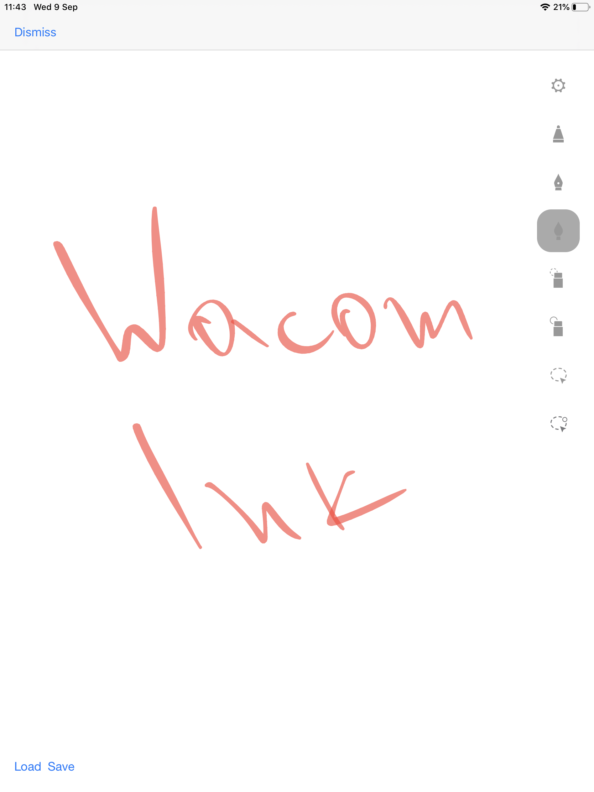
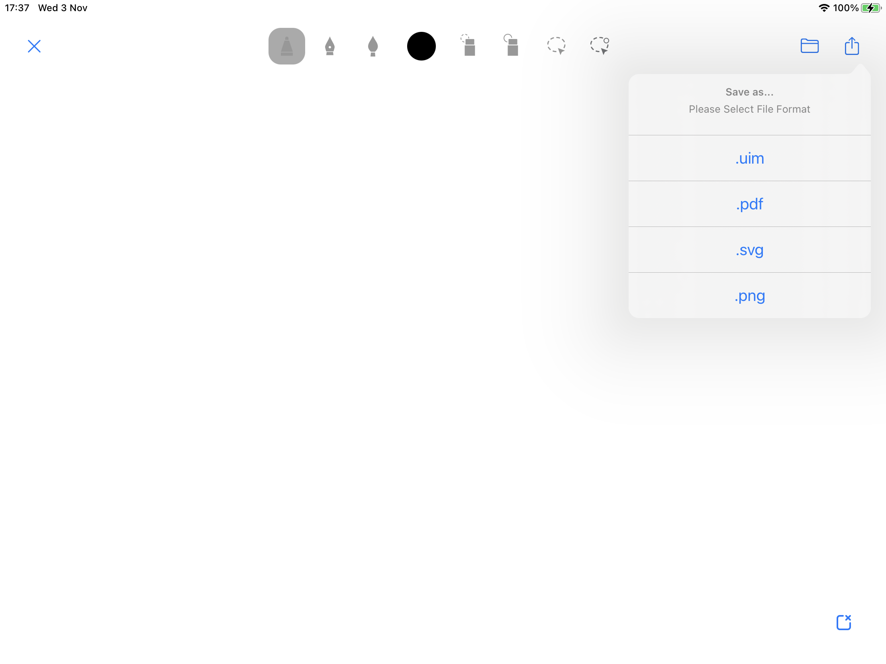

# Getting Started 

## iOS Development Environment

The WILL SDK for Ink requires Xcode 11 or higher

## Download the SDK

Download the SDK from https://developer.wacom.com/developer-dashboard

* Login using your Wacom ID
* Select **Downloads for ink**
* Download **WILL SDK for ink for iOS (version 3.0)**
* Accept the End User License Agreement to use the SDK

The downloaded Zip file contains the SDK with documentation.

## SDK License

The SDK is free of charge and does not need a license.

## Using the WILL SDK for ink

### Folder structure
The folder contains the following:

* documentation - contains api references 
* sdk - contains the WacomInk framework
* readme.txt

## Configure your Xcode Project

To build and run the sample app follow these steps:

* Download the SDK from our site
* Drag the WacomInk.xcframework folder into your Xcode project
* Depending on your needs, you can clear or select the 'Copy items if needed'.
* Make sure 'Embed & Sign' is selected under 'Frameworks, Libraries, and Embedded Content'

## Run the sample:

### Export utilities

The Export Utilities for iOS can be accessed through the Save as... button in the top bar of the WILL SDK for Ink.

The user may then export the file to a format of their choosing.

---
